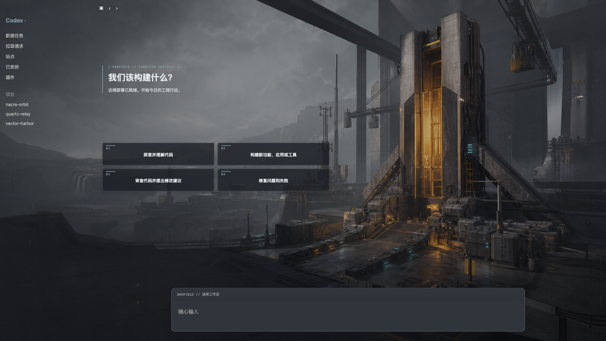
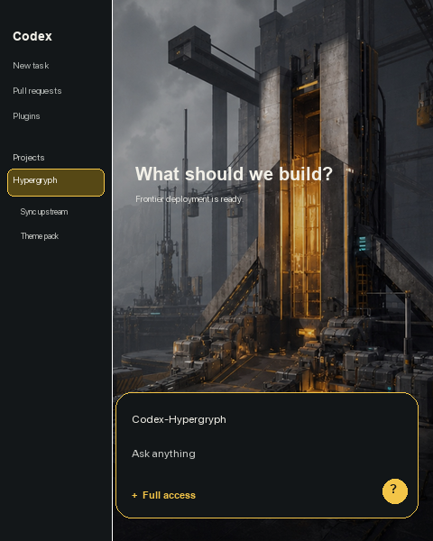

# Codex Hypergryph Theme

非官方 Codex Desktop 工业科幻主题，支持 macOS 与 Windows。视觉灵感来自鹰角网络《明日方舟》与《明日方舟：终末地》的边境工程美术语言。

  
   
  当前主题 CSS 与布局的脱敏预览；项目名均为虚构占位。

## 最少安装步骤

先完全退出 Codex，再下载并解压本仓库。

### macOS

双击 `安装终末地主题-macOS.command`。

### Windows

安装 Node.js 22 或更高版本，然后双击 `安装终末地主题-Windows.cmd`。脚本会自动识别 PATH、fnm、nvm-windows、Volta 与常见安装目录中的可用版本，不要求当前终端默认的 `node` 恰好是 22。

如果启动失败，双击 `检查终末地主题环境-Windows.cmd` 可执行只读检查，验证 PowerShell、Node.js、Codex Store 安装、主题资源与注入器。Windows 版会使用 `%LOCALAPPDATA%\CodexDreamSkin\codex-profile` 作为持久化主题配置目录，以兼容 Chromium 136 之后的远程调试安全限制；官方 Codex 配置目录不会被改作调试配置，首次进入主题配置时可能需要重新登录。

以后重新启用或停用主题，双击同目录中对应的“启动”或“停用主题并恢复官方外观”文件即可。

## 特性

- 四张首页操作卡始终保持 2 × 2，图标已隐藏并改用 `01–04` 编号
- 已验证 `480 × 600` 至 `2560 × 1440`，兼容侧栏展开、收起和矮窗口
- macOS / Windows 使用同一套背景、颜色和布局
- 不修改 Codex 官方安装包，不在桌面或开始菜单创建文件
- Windows 主题会话使用独立、持久化的本机配置目录，不覆盖官方 Codex 浏览器配置
- 恢复只撤销主题与本机调试会话，不删除任务、账号、插件或项目

## Windows 依赖结构

Windows 版直接依赖 [Fei-Away/Codex-Dream-Skin](https://github.com/Fei-Away/Codex-Dream-Skin) 的安装、启动、恢复、配置事务与 CDP 注入引擎，不再维护一份混合了本项目改动的运行时分叉：

- `vendor/Codex-Dream-Skin` 固定上游提交 `a1c48b3`，保存引擎脚本、测试和许可证
- `.runtime-windows/assets` 只保存终末地 CSS、renderer、配置与原创背景
- `.runtime-windows/scripts` 只负责 Node.js 探测、临时组装资源包和调用上游入口

安装时会临时组装“固定上游引擎 + 终末地资源”，再由上游安装事务复制到 `%LOCALAPPDATA%\CodexDreamSkin\engine`。发布包不依赖 Git，也不需要在安装时联网。出于企业终端安全要求，vendored 上游移除了 3 处隐藏窗口启动参数；完整差异见 [`vendor/Codex-Dream-Skin/PATCHES.md`](./vendor/Codex-Dream-Skin/PATCHES.md)。维护与升级说明见 [`docs/windows-architecture.md`](./docs/windows-architecture.md)。

最小窗口预览

  

## 来源与声明

主题运行框架依赖 [Fei-Away/Codex-Dream-Skin](https://github.com/Fei-Away/Codex-Dream-Skin) 的 MIT 许可代码；上游许可证与声明保留在 [`vendor/Codex-Dream-Skin`](./vendor/Codex-Dream-Skin)。

本项目与 OpenAI、鹰角网络均无隶属、授权或背书关系。仓库未包含官方游戏 CG、角色立绘或商标图形；背景为本项目生成的原创工业科幻画面。详细说明见 [NOTICE.md](./NOTICE.md) 与 [ASSET-PROVENANCE.md](./ASSET-PROVENANCE.md)。

## License

代码采用 [MIT License](./LICENSE)。原创背景与脱敏预览采用 [CC BY 4.0](https://creativecommons.org/licenses/by/4.0/)。
